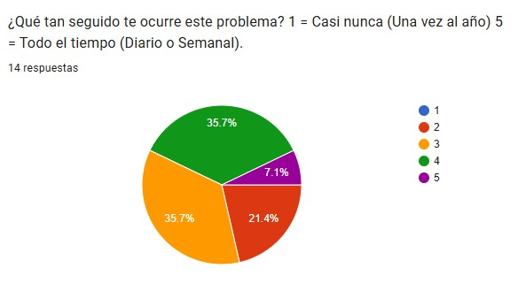
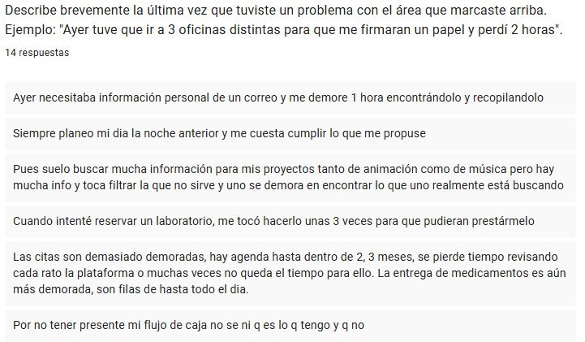
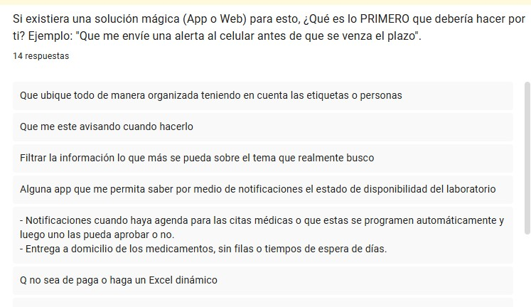

# Identificando Requerimientos Técnicos

### Enlace a formulario [aqui](https://docs.google.com/forms/d/14mOfWPNB5BxJi-QCDU488GRG4n2E6giOFRfNVIkqlqY/edit#responses)

## ¿Qué duele?
 En todas las respuestas hay patrones recurrentes asociados a pérdida de tiempo en tareas simples, por ejemplo: 1 hora buscando información en un correo, Filas de todo el día para medicamentos, Procesos largos ára reservar laboratorios/citas, dos semanas esperando un documento, etc. Todos estos problemas tienen que ver con los procesos mal diseñados como: call centers ineficientes, entrega de documentos o medicamentos demorada, documentación mal subida por colaboradores.
 

 
## Frecuencia
La mayoria experimenta este tipo de problema frecuentemente. Según la encuesta casi el 70% encuentra este con una frecuencia media-alta(3,4). Por otro lado ni un encuestado considera que el problema casi nunca ocurra. Solo una persona experimenta el problema en nivel máximo. Más del 90% lo vive en un rango de frecuencia media o alta (niveles 2, 3, y 4).

## La Solución Soñada
 Hay varios puntos en común en las respuestas dadas como la automatización de procesos , por ejemplo: Programar citas automáticamente, Registrar gastos, Verificación de dcoumentos, etc. Muchos de ellos quieren notificaciones, Avisos, Recordatorios y alertas. También quieren una estructura clara y visualización organizada.

 

## Historia de Usuario Principal (User Story)
 
- Como estudiante o profesional, quiero organizar mis archivos y correos por etiquetas y personas, para encontrar información importante rápidamente sin perder tiempo buscándola. (Gestión de información)
- Como paciente, quiero recibir notificaciones cuando hayan mediacamentos disponibles. (Gestión médica)
- Como usuario, quiero que la app me indique mi monto máximo de gasto semanal y mensual, para no exceder mi presupuesto. (Gestión financiera personal)
- Como usuario que busca mejorar sus hábitos, quiero que la app me ayude a programar horarios de sueño y rutinas diarias, para optimizar mi tiempo. (Organización personal y productividad)

### Criterios de Aceptación (Definition of Done)
**Generales**
- El sistema debe funcionar en móviles (Responsive).
- El usuario debe poder activar o desactivar notificaciones desde su perfil.
- El sistema debe enviar confirmación inmediata (push o correo) cada vez que se realice una acción crítica (reserva, cita, registro de gasto, evento).
- El usuario debe recibir recordatorios al menos 24 horas antes de un evento programado.

    **Gestión de información**
    - El usuario debe poder crear, editar y eliminar etiquetas personalizadas. 
    - El sistema debe guardar automáticamente cambios realizados en documentos o registros. 

    **Gestión de médica**
    - El estado de la cita (pendiente, confirmada, cancelada) debe actualizarse en tiempo real.
    - El sistema debe permitir programar citas automáticamente según disponibilidad detectada. 
    - El usuario debe poder aprobar o rechazar una cita propuesta en un solo clic. 

    **Gestión financiera**
    - El usuario debe poder registrar ingresos y gastos manual o automáticamente. 
    - El sistema debe mostrar en tiempo real el saldo disponible.
    - El historial financiero debe poder visualizarse por día, semana y mes.  

### Requisitos Funcionales (Draft Técnico)
**Generales**
- RF-01: Módulo de Registro y Login (Autenticación).
- RF-02: Gestión de Perfil de Usuario. El usuario debe poder editar datos personales y configurar preferencias.

    **Gestión de información**
    - RF-03: RF-07: Creación y Gestión de Etiquetas. El usuario debe poder crear, editar y eliminar etiquetas para organizar información.
    - RF-04: Filtro Inteligente de Información. El sistema debe permitir aplicar filtros personalizados para mostrar solo información relevante.

    **Gestión de médica**
    - RF-03: Consulta de Disponibilidad. El sistema debe consultar disponibilidad de citas o laboratorios en tiempo real.
    - RF-04: Aprobación o Rechazo de Citas. El usuario debe poder aprobar o rechazar citas propuestas.
    - RF-05: Notificación de Estado de Citas. El sistema debe notificar cambios de estado (pendiente, confirmada, cancelada).

    **Gestión financiera**
    - RF-04: Registro de Ingresos y Gastos. El usuario debe poder registrar ingresos y gastos manualmente.
    - RF-05: Configuración de Límites de Gasto. El usuario debe poder establecer límites semanales y mensuales.
    - RF-06: Alertas de Exceso de Presupuesto. El sistema debe generar alertas automáticas cuando se alcance un porcentaje crítico del límite.

## Evidencias
## Entrevistas Transcripciones:
### Myriam Orozco
    
    
    - Entrevistador: "¿En qué área sientes que pierdes más tiempo o control actualmente?"

    - Mama : "En la salud"

    - Entrevistador: "Describe brevemente la última vez que tuviste un problema con el área que marcaste arriba."

    - "me demoro más de una hora en el telefono, para sacar una cita para mi mamá."

    - ¿Qué tan seguido te ocurre este problema? 1 = Casi nunca (Una vez al año) 5 = Todo el tiempo (Diario o Semanal).

    -" 4 , me pasa muy seguido puesto que mi mamá es un adulto mayor y necesita del servicio de salud muy seguido."

    - Si existiera una solución mágica (App o Web) para esto, ¿Qué es lo PRIMERO que debería hacer por ti? Ejemplo: "Que me envíe una alerta al celular antes de que se venza el plazo".

    - "que si el medico ordena un examen, el sistema busque una cita y no se uno el que pida la cita"

### Pablo Guaqueta

    - Entrevistador: "¿En qué área sientes que pierdes más tiempo o control actualmente?"

    - "haciendo filas para bancos."

     - Entrevistador: "Describe brevemente la última vez que tuviste un problema con el área que marcaste arriba."

    
    - "Cuando voy a los bancos a consignar plata se demoran mucho en atender a la gente."

    - ¿Qué tan seguido te ocurre este problema? 1 = Casi nunca (Una vez al año) 5 = Todo el tiempo (Diario o Semanal).

    - "4"

    - Si existiera una solución mágica (App o Web) para esto, ¿Qué es lo PRIMERO que debería hacer por ti? Ejemplo: "Que me envíe una alerta al celular antes de que se venza el plazo".

    - "Una aplicación que este dipsonivle 24 horas al día sin fallas ,por ejemplo nequi que se cae todo el tiempo ."

### Juan Pablo Guaqueta
    - Entrevistador: "¿En qué área sientes que pierdes más tiempo o control actualmente?"
    
    - Entrevistador: "Describe brevemente la última vez que tuviste un problema con el área que marcaste arriba."
    
    - "Gestión de dinero"

    - "La Gente a quienes le vendo productos, no me pagan en el momento y pierdo tiempo recordandoles pagarme."

    - ¿Qué tan seguido te ocurre este problema? 1 = Casi nunca (Una vez al año) 5 = Todo el tiempo (Diario o Semanal).

    - "3"

    - Si existiera una solución mágica (App o Web) para esto, ¿Qué es lo PRIMERO que debería hacer por ti? Ejemplo: "Que me envíe una alerta al celular antes de que se venza el plazo".

    -"Que me envie una notificación de quiénes no me han pagado con un conteo de cuanto se demoran en pagarme."

### Julian Grisales

    - Entrevistador: "¿En qué área sientes que pierdes más tiempo o control actualmente"

    - "Me demoro mucho haciendo filas para sacar documentos"

    - Entrevistador: "Describe brevemente la última vez que tuviste un problema con el área que marcaste arriba."

    - "La última vez que ocurrio fue cuando estaba sacando la licencia de conducción."

    - ¿Qué tan seguido te ocurre este problema? 1 = Casi nunca (Una vez al año) 5 = Todo el tiempo (Diario o Semanal).

    - " 3"

    - Si existiera una solución mágica (App o Web) para esto, ¿Qué es lo PRIMERO que debería hacer por ti? Ejemplo: "Que me envíe una alerta al celular antes de que se venza el plazo".

    - "Que diga que llena este una sede de la ventanilla unica de servicios y en base en eso escogerr la sede."
